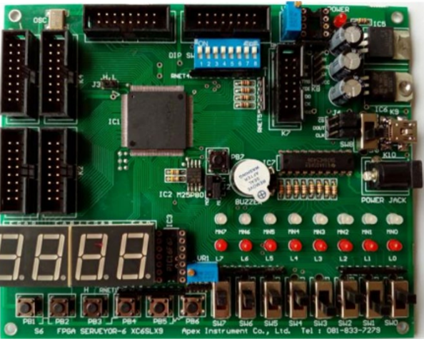

# 🚢 FPGA Battleship 

**FPGA Battleship** is a digital version of the classic Battleship board game, developed on a Spartan-6 FPGA. This project is part of a Digital System Fundamentals course and is designed to apply and deepen understanding of FPGA programming and digital design principles.

## 💻 Hardware Requirements

  

### FPGA Board
This project is developed on the FPGA Surveyor-6 XC6SLX9 board, which utilizes the Xilinx Spartan-6 XC6SLX9 FPGA chip. Compatible hardware may be used for similar implementations. However, this specific board offers several built-in features that streamline development, including:

- **One-shot and Active Debounced Push Buttons:** These buttons provide stable input signals without the need for additional debounce circuitry.
- **Built-in Slide Switches:** These switches offer additional input options, useful for settings or mode selection in the game.
- **Built-in Seven-Segment Display:** This display is ready for immediate use, eliminating the need for external display modules or complex driver implementation.
- **Integrated Buzzer:** A buzzer is included, which simplifies audio feedback in the game without requiring custom implementation.

These built-in components greatly reduce the need for additional peripheral circuits, allowing for a more straightforward development process focused on game logic and control.

To enable multiplayer gameplay, a second FPGA board is required. Both boards can be programmed using the same programming file.

### Monitor

To display game data, two VGA-compatible monitors are required. Each monitor must support at least a 640 x 480 pixel resolution and a 60 Hz refresh rate.

## 📊 Software Requirements

This project was developed using **Xilinx ISE Design Suite 14.7**, installed on a virtual machine. Alternative software may be used as long as it supports VHDL and is compatible with the target FPGA chip

## ⬇️ Installation

You can simply install and build the project yourself by following these instruction.

1. **Create a New Project:** Start by creating a new project in your design software and configure it with the settings for your target FPGA.
2. **Import Source Files:** Copy all schematic files, symbol files, and VHDL files from the `src` folder to your project directory.
3. **Add Sources:** In the design tab, right-click on your project and select Add Source.
4. **Select Files:** Choose all the schematic, symbol, and VHDL files that you previously imported.
5. **Set Top-Level Module:** Set `FPGABattleship.sch` as the top-level module.
6. **Modify Pin Configuration (Optional):** Edit the `pins.ucf` file if you need to change the I/O pin assignments.
7. **Generate Programming File:** Compile the project to generate the programming file, then flash it onto your target hardware as usual.

## 📌 FPGA Pinouts

Refer to the [src/pin.ucf](./src/pins.ucf) file for the FPGA pinout configuration. Ensure that the two FPGA boards are correctly connected, as they communicate via parallel communication wiring. Proper alignment of pins is essential for accurate data exchange between the boards.
